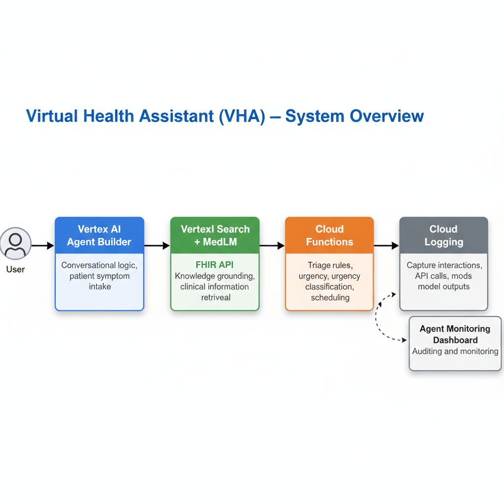

# Virtual Health Assistant - Dialogflow CX Agent

A conversational AI health assistant built with Google Cloud Dialogflow CX, designed to help patients describe symptoms and receive triage recommendations. The agent provides empathetic, evidence-based guidance through a natural conversation flow.

## 🎯 Features

- **Symptom Intake**: Natural language symptom description and collection
- **Intelligent Triage**: 4-level triage system (Emergency → Urgent → Same-Week → Routine)
- **Clarifying Questions**: Context-aware follow-up questions
- **Personalized Responses**: Empathetic, context-aware responses
- **Conversation History**: Automatic saving and retrieval of conversations
- **Web Frontend**: Modern, responsive chat interface
- **RAG Integration**: Evidence-based responses using Vertex AI Search (optional)

## 🏗️ Architecture



## 📋 Prerequisites

- Python 3.8+
- Google Cloud Project with:
  - Dialogflow CX API enabled
  - Vertex AI Search API enabled (optional, for RAG)
  - Service account with appropriate permissions
- Node.js (optional, for frontend development)

## 🚀 Quick Start

### 1. Clone the Repository

```bash
git clone <repository-url>
cd vertex-ai-poc
```

### 2. Install Dependencies

```bash
pip install -r requirements.txt
```

### 3. Configure Credentials

1. Create a service account in Google Cloud Console
2. Download the JSON key file
3. Place it in the project root as `key.json` (or update paths in code)
4. **Important**: `key.json` is in `.gitignore` - never commit credentials!

### 4. Configure Agent

1. Update `agent_info.json` with your agent details:
```json
{
  "project_id": "your-project-id",
  "location": "us-central1",
  "agent_id": "your-agent-id"
}
```

### 5. Run the Frontend

```bash
python app.py
```

The frontend will be available at `http://localhost:5000`

## 📁 Project Structure

```
.
├── app.py                          # Flask backend server
├── main.py                         # Cloud Function entry point
├── requirements.txt                 # Python dependencies
├── key.json                        # Service account key (NOT in repo)
├── agent_info.json                 # Agent configuration (NOT in repo)
│
├── static/                         # Frontend static files
│   ├── style.css
│   └── script.js
│
├── templates/                      # HTML templates
│   └── index.html
│
├── scripts/                        # Setup and utility scripts
│   ├── create_agent.py
│   ├── create_flows.py
│   ├── test_agent.py
│   └── ...
│
├── docs/                           # Documentation
│   ├── SETUP_GUIDE.md
│   ├── API_REFERENCE.md
│   └── ...
│
├── tests/                          # Test files
│   └── test_scenarios.json
│
└── guidelines/                     # Clinical guidelines (optional)
```

## 🔧 Configuration

### Agent Configuration

The agent uses Dialogflow CX with the following flow:

1. **Start Page**: Initial greeting and symptom collection
2. **Symptom Intake**: Collects symptom type, duration, and severity
3. **Clarifying Questions**: Asks about associated symptoms, triggers, impact
4. **Triage Evaluation**: Determines urgency level (Emergency/Urgent/Same-Week/Routine)
5. **Summary**: Provides recommendations and next steps

### Triage Levels

- **Emergency**: Severity ≥9, red flags, or high urgency → Immediate care
- **Urgent**: Severity 7-8, persistent symptoms → Same-day care
- **Same-Week**: Severity 5-6, multiple days → Schedule appointment
- **Routine**: Mild symptoms, short duration → Self-care and monitoring

## 🧪 Testing

### Run Automated Tests

```bash
python scripts/test_agent.py
```

### Test Scenarios

Test scenarios are defined in `tests/test_scenarios.json`:

- Headache (low severity)
- Headache (high severity)
- Nausea with red flags
- Dizziness with associated symptoms

## 📚 Documentation

- **[Setup Guide](docs/SETUP_GUIDE.md)**: Complete setup instructions
- **[API Reference](docs/API_REFERENCE.md)**: API endpoint documentation
- **[Agent Configuration](docs/AGENT_CONFIG.md)**: Agent setup and customization
- **[RAG Integration](docs/RAG_INTEGRATION.md)**: Vertex AI Search integration
- **[Deployment Guide](docs/DEPLOYMENT.md)**: Deployment to production

## 🌐 Deployment

### Frontend Deployment

1. Deploy Flask app to Cloud Run or App Engine:
```bash
gcloud run deploy health-assistant-frontend \
  --source . \
  --platform managed \
  --region us-central1
```

### Cloud Function (Webhook)

1. Deploy the webhook:
```bash
gcloud functions deploy simplified-rag-webhook \
  --runtime python311 \
  --trigger-http \
  --allow-unauthenticated \
  --source . \
  --entry-point app
```

### Environment Variables

Set these in your deployment:
- `GOOGLE_APPLICATION_CREDENTIALS`: Path to service account key
- `PROJECT_ID`: Your GCP project ID
- `AGENT_ID`: Your Dialogflow CX agent ID

## 🔐 Security

- **Never commit** `key.json` or service account keys
- Use environment variables for sensitive configuration
- Enable IAM authentication for production deployments
- Review and limit service account permissions
- Use HTTPS in production

## 📝 Development

### Adding New Features

1. Agent changes: Update Dialogflow CX agent via console or scripts
2. Frontend changes: Modify `static/` and `templates/` files
3. Backend changes: Update `app.py` for API endpoints

### Code Style

- Follow PEP 8 for Python code
- Use meaningful variable names
- Add docstrings to functions
- Comment complex logic

## 🤝 Contributing

1. Fork the repository
2. Create a feature branch (`git checkout -b feature/amazing-feature`)
3. Commit your changes (`git commit -m 'Add amazing feature'`)
4. Push to the branch (`git push origin feature/amazing-feature`)
5. Open a Pull Request

## 📄 License

This project is licensed under the MIT License - see the [LICENSE](LICENSE) file for details.

## 🆘 Support

For issues and questions:
- Open an issue on GitHub
- Check the [documentation](docs/)
- Review [common issues](docs/TROUBLESHOOTING.md)

## 🙏 Acknowledgments

- Google Cloud Dialogflow CX
- Vertex AI Search
- Flask web framework
- Clinical guidelines from medical literature

## 📊 Status

- ✅ Core agent functionality
- ✅ Frontend interface
- ✅ Triage logic
- ✅ Conversation history
- ✅ Parameter extraction
- ⚠️ RAG integration (requires datastore setup)
- 🔄 Continuous improvements

---

**Note**: This is a proof-of-concept implementation. For production use, ensure:
- Proper medical review and validation
- HIPAA compliance measures
- Robust error handling
- Comprehensive testing
- Security audit
